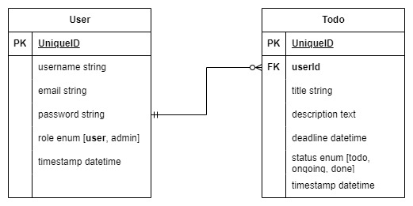

# API Design

## Project Idea

I plan to make a rest API for todo list system. User must be logged in to read, create, update and delete their todos. Admin can manage users. Every todo has title, description, status (todo, in rogress or done).

## SRS

### Project Name

My project name is 'TODO'.

### Introduction

- Purpose: The purpose of this document is to outline the requirements for developing a simple Todo List API that allows users to manage their todos.
- Scope: The API will provide functionality for user registration, login, and CRUD operations for todos (create, read, update, delete).

### System Overview

- The Todo List API will be a web-based service accessible via HTTP.
- The API will be built using a RESTful architecture.
- Users will interact with the API using HTTP methods (GET, POST, PUT, DELETE) and JSON data.

### Functional requirements

1. User Management
    - Allow users to register by providing a unique username, email, and password.
    - Validate input data during user registration.
    - Store user information securely.
    - Enable users to log in using their username and password.
    - Authenticate user credentials and issue an authentication token.

2. Todo Management
    - Authenticated users can create new todos.
    - Each todo should have a title, description, status, due date, and associated user ID.
    - Enable users to retrieve a list of their todos.
    - Allow users to retrieve a single todo by its unique identifier.
    - Enable users to update the title, description, status, and due date of their todos.
    - Allow users to delete their todos.

3. Admin Management
    - Admin users can create, update, and delete user accounts.
    - Admin users can retrieve a list of users and access individual user profiles.

### Non-Functional Requirements:

1. Authentication and Authorization
    - Implement token-based authentication to secure endpoints.
    - Issue authentication tokens upon successful login.
    - Validate tokens for authentication and authorization purposes.
    - Restrict access to certain endpoints based on user roles.

2. Error Handling
    - Provide appropriate error messages and status codes for different types of errors.
    - Return error responses in a consistent format (e.g., JSON).

3. Security
    - Store user passwords securely using cryptographic hashing algorithms.
    - Protect against common security vulnerabilities, such as SQL injection and cross-site scripting.
    - Enforce secure communication over HTTPS.

4. Scalability
    - Deploy the API on a scalable infrastructure to handle increasing user traffic.
    - Implement load balancing and caching mechanisms for optimal performance.

5. User Interface (UI)
    - The API will be accessed via HTTP requests and will not have a graphical user interface (GUI).
    - Client applications will interact with the API using HTTP methods and JSON data.

## Entities / Schema / Model

- User
    - id - integer
    - username - string
    - email - string
    - password - string (hashed)
    - role - enum [user, admin] (default user)
    - timestamp
- Todo
    - id - integer
    - todo - string
    - description - text
    - status - enum [todo, ongoing, done] (default todo)
    - deadline - datetime
    - userId - integer (relation with user)
    - timestamp

## ER Diagram

